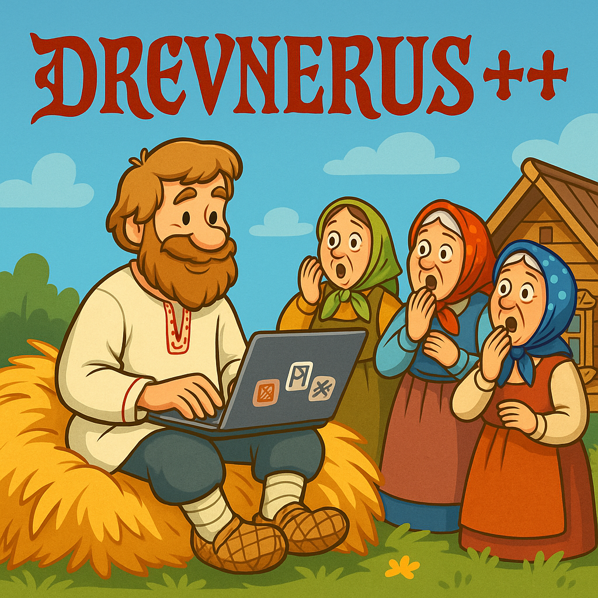

<div align="center">
  
  
  # 🛡️ Implementation of the programming language "DREVNERUS++" in C (C++)
  
  
  
</div>

## 🚀 Quick Start:
To build the project:
```cpp
git clone https://github.com/BulgakovDmitry/myLanguage
cd myLanguage
make run
./language.out
./asm.out
./proc.out
```
The project has a function for graphical output of a binary tree. For this purpose graphviz is used. Download it on linux at the following script:
```bash
sudo apt update
sudo apt install graphviz
```

## 🔍 Overview:
The language consists of 3 parts:
- frontend
- middleend
- backend

## Frontend
Frontend translates text into a binary tree. Below is an example of tree structure.
```cpp
struct Node
{
    Type  type;
    Value value;
    Node* left;
    Node* right;
};
```
For convenience the value type is chosen as union
```cpp
union Value
{
    double num;
    size_t op;
    char*  id;
};
```
When you start the program, the first thing that starts working is the lexical analyzer. Its purpose is to break the code from the file into tokens (an elementary code unit). For convenience, the structure of a token is the same as that of a tree. Although we don't use Node* left and Node* right pointers, it is very convenient to store the token type and its value in this structure.
A Vector data structure (shown below) was created to conveniently store tokens:
```cpp
struct Vector
{
    V_CAN_PR(Canary_t leftVectorCanary;)

    size_t   coefCapacity;
    uint64_t errorStatus;

    void**  data;
    size_t  size;
    size_t  capacity;

    #ifdef VECTOR_HASH_PROTECTION
    uint64_t dataHashSum;
    uint64_t vectorHashSum;
    #endif

    V_CAN_PR(Canary_t rightVectorCanary;)
};
```
As a result of lexical analysis we get a Vector with tokens.
After that, the tree parsing is triggered. It takes a vector with tokens and starts translating it into a binary tree (at the same time checking the code grammar).
The grammar of the language is given below:
```txt
Program     ::= StmtList 'amin'
StmtList    ::= { Statement 'don' }

Statement   ::= Assignment | IfStmt  | WhileStmt | 
                VarDef     | FuncDef | FuncCall  | 
                Return     | Input   | Print

IfStmt      ::= 'koli'   Expression '{' StmtList '}'
WhileStmt   ::= 'dokole' Expression '{' StmtList '}'

Assignment  ::= 'da' 'budet'    Var 'podobno' Expression
VarDef      ::= 'da' 'pribudet' Var 'podobno' Expression 
FuncDef     ::= 'zamysel' ID '(' ParamList ')' '{' StmtList '}'
ParamList   ::= Var ( ',' Var )*

Return      ::= 'vozvratishi' Expression
Input       ::= 'pozhertvui' 'radi' Var
Print       ::= 'glagoli' 'yasno' Expression
FuncCall    ::= ID '(' ArgList ')'
ArgList     ::= Expression ( ',' Expression )*

Expression  ::= Equality
Equality    ::= Rel ( ( '==' | '!=' ) Rel )*
Rel         ::= AddSub ( ( '<' | '>' | '<=' | '>=' ) AddSub )*
AddSub      ::= MulDiv ( ( '+' | '-' ) MulDiv )*
MulDiv      ::= Pow ( ( '*' | '/' ) Pow )*
Pow         ::= Unary ('^' Unary )*
Unary       ::= ( '+' | '-' | FuncOper )? Primary
FuncOper    ::= 'sin' | 'cos' | 'tg' | 'ln' | 'sqrt'
Primary     ::= '(' Expression ')'| Var | Number | FuncCall

Var         ::= ID
ID          ::= ([a-z] | [A-Z])+
Num         ::= ['0'-'9']+
```
Tree parsing is implemented by recursive descent algorithm.
As a result of the algorithm, we get a binary tree. Below is a fragment of its graphical dump:
