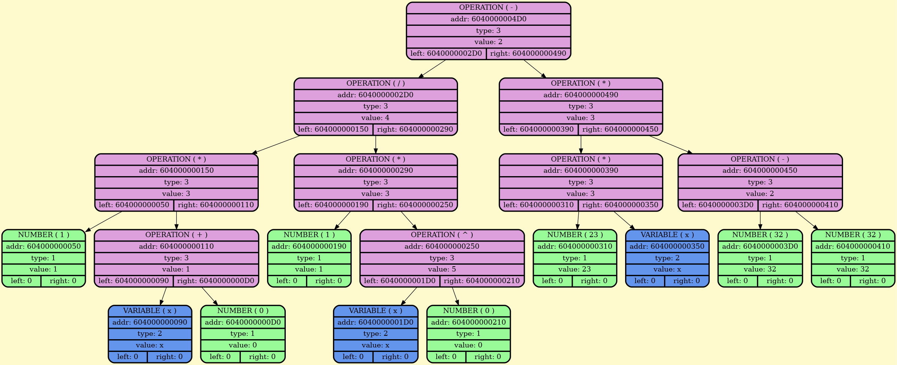
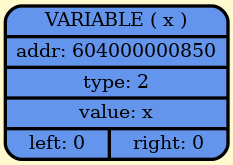

<div align="center">
  
  
  # 🛡️ Implementation of the programming language "DREVNERUS++" in C (C++)
  
  
  
</div>

## 🚀 Quick Start:
To build the project:
```cpp
git clone https://github.com/BulgakovDmitry/myLanguage
cd myLanguage
make run
./language.out
./asm.out
./proc.out
```
The project has a function for graphical output of a binary tree. For this purpose graphviz is used. Download it on linux at the following script:
```bash
sudo apt update
sudo apt install graphviz
```

## 🔍 Overview:
The language consists of 3 parts:
- [Frontend](#frontend)
- [Middleend](#middleend)
- [Backend](#backend)

## Frontend
Frontend translates text into a binary tree. Below is an example of tree structure.
```cpp
struct Node
{
    Type  type;
    Value value;
    Node* left;
    Node* right;
};
```
For convenience the value type is chosen as union
```cpp
union Value
{
    double num;
    size_t op;
    char*  id;
};
```
When you start the program, the first thing that starts working is the lexical analyzer. Its purpose is to break the code from the file into tokens (an elementary code unit). For convenience, the structure of a token is the same as that of a tree. Although we don't use Node* left and Node* right pointers, it is very convenient to store the token type and its value in this structure.
A Vector data structure (shown below) was created to conveniently store tokens:
```cpp
struct Vector
{
    V_CAN_PR(Canary_t leftVectorCanary;)

    size_t   coefCapacity;
    uint64_t errorStatus;

    void**  data;
    size_t  size;
    size_t  capacity;

    #ifdef VECTOR_HASH_PROTECTION
    uint64_t dataHashSum;
    uint64_t vectorHashSum;
    #endif

    V_CAN_PR(Canary_t rightVectorCanary;)
};
```
As a result of lexical analysis we get a Vector with tokens.
After that, the tree parsing is triggered. It takes a vector with tokens and starts translating it into a binary tree (at the same time checking the code grammar).
The grammar of the language is given below:
```txt
Program     ::= StmtList 'amin'
StmtList    ::= { Statement 'don' }

Statement   ::= Assignment | IfStmt  | WhileStmt | 
                VarDef     | FuncDef | FuncCall  | 
                Return     | Input   | Print

IfStmt      ::= 'koli'   Expression '{' StmtList '}'
WhileStmt   ::= 'dokole' Expression '{' StmtList '}'

Assignment  ::= 'da' 'budet'    Var 'podobno' Expression
VarDef      ::= 'da' 'pribudet' Var 'podobno' Expression 
FuncDef     ::= 'zamysel' ID '(' ParamList ')' '{' StmtList '}'
ParamList   ::= Var ( ',' Var )*

Return      ::= 'vozvratishi' Expression
Input       ::= 'pozhertvui' 'radi' Var
Print       ::= 'glagoli' 'yasno' Expression
FuncCall    ::= ID '(' ArgList ')'
ArgList     ::= Expression ( ',' Expression )*

Expression  ::= Equality
Equality    ::= Rel ( ( '==' | '!=' ) Rel )*
Rel         ::= AddSub ( ( '<' | '>' | '<=' | '>=' ) AddSub )*
AddSub      ::= MulDiv ( ( '+' | '-' ) MulDiv )*
MulDiv      ::= Pow ( ( '*' | '/' ) Pow )*
Pow         ::= Unary ('^' Unary )*
Unary       ::= ( '+' | '-' | FuncOper )? Primary
FuncOper    ::= 'sin' | 'cos' | 'tg' | 'ln' | 'sqrt'
Primary     ::= '(' Expression ')'| Var | Number | FuncCall

Var         ::= ID
ID          ::= ([a-z] | [A-Z])+
Num         ::= ['0'-'9']+
```
Tree parsing is implemented by recursive descent algorithm.
As a result of the algorithm, we get a binary tree. Below is a fragment of its graphical dump:
<div align="center">
    
</div>

## Middleend
This block is used to manage the tree. 
In my implementation there are only arithmetic operations: addition and subtraction with zero, multiplication by zero, multiplication by one, division by one, ascending to zero and first degree, convolution of constants (with internal calculation of arithmetic expression).
The result is a simplified tree that is faster to process.
For example, if the following mathematical expression occurred in the tree:
<div align="center">
    
</div>
Then this tree will be replaced by the following
<div align="center">
    
</div>
Middlend makes the program simpler and executes faster

## Backend
Backend task to translate the tree obtained by the frontend into code for spu.
The backend writes the jmp command to the main label at the beginning, then writes out the function implementations. 
Functions are organized according to the following structure: first the function label is written, after that you may encounter lines with the pop command - this is the receipt by the function of its arguments, only after that comes the body of the function and the final ret.
Here is an example of function realization (discriminant counting):
```asm
deskriminati:
pop [2]
pop [1]
pop [0]
push 0
pop [3]
push [1]
push [1]
mul
push 4
push [0]
mul
push [2]
mul
sub
pop [3]
push [3]
ret
```
After all functions are declared, the main label is written to spu, after which the main program code begins. This structure is implemented for the convenience of human understanding of the code and the structuredness of assembly code.

## 💡 Usage example:
Here is an example of a program written in “DREVNERUS++” language for solving quadratic equations:
```txt
zamysel deskriminati ( A , B , C )
{
    da pribudet D podobno 0 don
    da budet D podobno B * B - 4 * A * C don
    vozvratiti D don
} don

da pribudet a podobno 0 don
da pribudet b podobno 0 don
da pribudet c podobno 0 don

pozhertvui radi a don
pozhertvui radi b don
pozhertvui radi c don

da pribudet d podobno deskriminati ( a , b , c ) don

koli ( d > 0 )
{
    da pribudet q podobno sqrt d don 
    da pribudet x podobno ( 0 - b - q ) / ( 2 * a ) don
    da pribudet y podobno ( 0 - b + q ) / ( 2 * a ) don
    glagoli yasno x don
    glagoli yasno y don
} don

koli ( d == 0 )
{
    da pribudet z podobno ( 0 - b ) / ( 2 * a ) don
    glagoli yasno z don
} don

amin
```
Run our program:
<div align="center">
    
</div>
the program asks the user to enter coefficients a b c from the keyboard.
After which we see the output of two numbers (-1 and 2). These are the obtained roots
